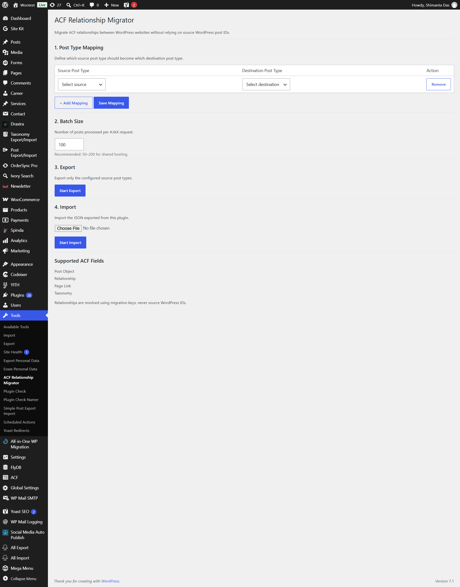

# ACF Relationship Migrator

**Version:** 2.0.0  
**Author:** Shimanta Das  
**License:** GPLv2 or later

---

## 📋 Description

ACF Relationship Migrator is a powerful WordPress plugin that allows you to batch migrate ACF relationship fields between websites without relying on WordPress post IDs. This plugin uses stable migration keys (post type + slug) to maintain relationships across different environments.

## 📋 Required JSON file download extension
Please download this extension from chrome webstore: https://chromewebstore.google.com/detail/json-beautifier-and-edito/lpopeocbeepakdnipejhlpcmifheolpl?pli=1

### Supported ACF Field Types

- **Post Object** - Single or multiple post references
- **Relationship** - Multiple post relationships
- **Page Link** - Page URL references
- **Taxonomy** - Term relationships

---

## 🚀 Features

- **ID-Free Migration** - Uses migration keys (post_type:slug) instead of fragile WordPress IDs
- **Batch Processing** - Handles large datasets with configurable batch sizes
- **Export/Import Workflow** - Simple two-step migration process
- **Post Type Mapping** - Map source post types to destination post types
- **Duplicate Detection** - Identifies duplicate migration keys to prevent conflicts
- **Progress Tracking** - Real-time progress bars and status updates
- **Fallback Resolution** - Intelligent fallback system for missing relationships
- **ACF Integration** - Works seamlessly with Advanced Custom Fields

---

## 📦 Installation

1. Upload `acf-relationship-migrator.php` to the `/wp-content/plugins/` directory
2. Activate the plugin through the 'Plugins' menu in WordPress
3. Navigate to **Tools → ACF Relationship Migrator** to access the interface

---

## 🔧 Usage

### Step 1: Configure Post Type Mappings

Define which source post types should map to which destination post types:

1. Select a **Source Post Type** from the dropdown
2. Select a **Destination Post Type** from the dropdown
3. Click **Save Mapping** to store your configuration
4. Add multiple mappings as needed

> **Note:** If no mapping is configured for a post type, the plugin will use the same post type on the destination site.

### Step 2: Set Batch Size

Configure the number of posts processed per AJAX request:

- **Recommended:** 50-200 for shared hosting environments
- **Range:** 10-1000 posts per batch
- **Default:** 100 posts per batch

### Step 3: Export Content

1. Click **Start Export** to begin the export process
2. Monitor the progress bar and status updates
3. Once complete, click **Download Migration JSON** to save the export file
4. Transfer the JSON file to your destination WordPress site

### Step 4: Import Content

1. On the destination site, select the exported JSON file
2. Click **Start Import** to begin the import process
3. The plugin will:
   - Create new posts based on the export data
   - Store migration keys for future reference
   - Update relationship fields using migration keys
4. Monitor the progress bar for completion status

---

## 🔒 Security

- All AJAX requests are protected with nonce verification
- Only users with `manage_options` capability can access the plugin
- Exported JSON files are stored in a secure WordPress uploads directory
- File access is restricted and authenticated

---

## 💡 How It Works

### Export Process

During export, the plugin:

1. Reads all posts from configured source post types
2. Generates unique migration keys: `{post_type}:{post_slug}`
3. Extracts ACF relationship field values
4. Converts WordPress IDs to migration keys
5. Creates a JSON file with all data

### Import Process

During import, the plugin:

1. Parses the JSON migration file
2. Creates destination posts using slugs and titles
3. Stores migration keys as post meta (`_acfrm_migration_key`)
4. Builds an internal ID map: `migration_key → destination_post_id`
5. Resolves all relationships using the ID map
6. Updates ACF fields with resolved relationships

### Relationship Resolution

The plugin resolves relationships using this priority:

1. **Direct Map Lookup** - Check if the migration key exists in the ID map
2. **Fallback Search** - Find the post using `destination_type + slug`
3. **Missing Tracking** - Log unresolved relationships for review

